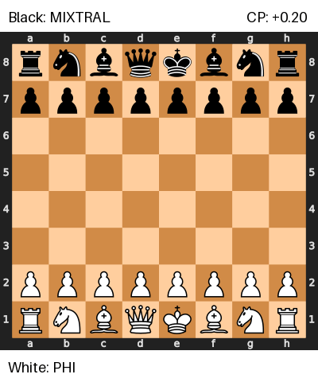
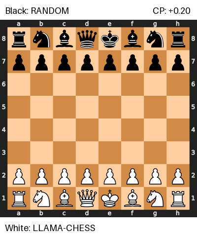
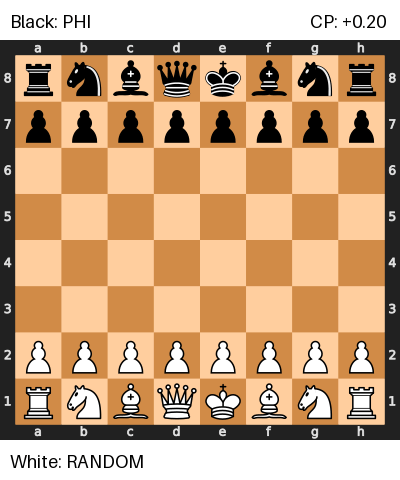
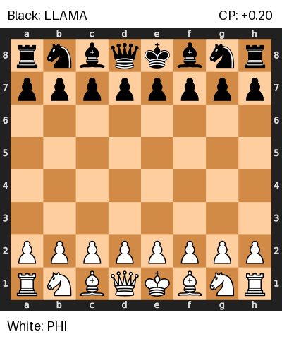
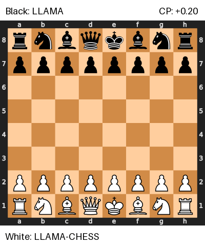

# LLMs Playing Chess Benchmark
## How to Use
1. Clone the repository:
   ```bash
   git clone https://github.com/Korius668/LLMs_Playing_Chess_Benchmark.git
   cd LLMs_Playing_Chess_Benchmark
   ```
2. Install the required dependencies:
   ```bash
   pip install -e .
   ```
3. Download Stockfish and set the path in the `.env` file:
   ```
   STOCKFISH_PATH=path/to/stockfish/executable
   ```

   https://stockfishchess.org/download/

4. Download Ollama
   https://ollama.com/download


5. Download FEN dataset
   https://www.kaggle.com/datasets/ffatty/350k-chess-positions-analyzed?resource=download


# Selected games:

  <div class="grid">
           
    
    
    
    
    
  </div>